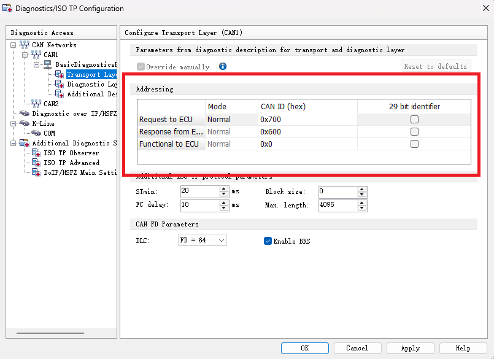

## 使用说明文档
### 1. 创建CANoe工程
Step-1、 安装CANoe软件: 请网上查阅相关教程；  
Step-2、 创建CANoe工程: 如下图，运行软件，点击File->New，选择对应的网络模板   

Step-3、 配置诊断工程相关配置项  
① 选择Diagnostic -> Diagnostic/ISO TP，在对应的CAN通道中，配置诊断描述（Diagnostic Description）
  
诊断描述导入方式主要有三种方式：第一种为车厂自定义CDD文件，第二种是Basic类型，可借助CANoe自带的基础诊断类型进行配置，第三种为Standard标准常见的CDD文件，也是CANoe软件自身提供。  
  
② 导入诊断描述后，对整个诊断ECU进行自定义命名ECU qualifier，在python框架中需要使用此命名来获取到诊断层的相关数据对象，可见后面章节描述。  
  
③ 接下来分别对传输层Transport Layer和诊断层Diagnostic Layer进行配置。传输层中需要对物理寻址和功能寻址进行配置。本工程中DiagCANoeProject工程中配置的物理寻址为0x741，功能寻址为0x7df，响应为0x749；由于不同车厂定义不同，请自行适配地址。  
  

④ 对于Basic类型，CANoe自带的Basic类型中，提供了一些常用的诊断类型可进行自定义配置，如：

### 2. 工程架构
```commandline
DiagAutoCANoe
├── DiagCANoeProject  # CANoe工程文件
├── pic               # 图片文件
├── venv              # python虚拟环境
└── CANoeCtrlIF.py    # CANoe软件工程控制层
├── RunScript.py      # 接口层
├── TestRunScript.py  # 测试脚本
└── 使用说明文档.md
```
### 3. 工程使用说明
`注意1：` 框架中的DiagCANoeProject工程中配置的物理寻址为0x741，功能寻址为0x7df，响应为0x749，由于不同车厂定义不同，请自行适配地址，否则无法正常进行测试。  
`注意2：` 框架中的DiagCANoeProject工程是基于Basic类型进行诊断服务的配置，若本身具备相应的CDD文件，请重新创建对应的诊断工程；  
`注意3：` 框架中测试脚本TestRunScript.py中，需要根据实际使用的CANoe工程信息，对`setup_class`的`run_script.initialize([path], [can], [ECU qualifier])`三个参数进行修改。  
`注意4：` 请根据实际测试场景，对TestRunScript.py的测试脚本Demo进行修改适配。其中`self.run_script.diag_test()`的参数定义如下：
 - 必填参数session： 诊断会话类型，可填空字符串，表示不进入某个会话；
 - 必填参数req_data：诊断请求数据，格式为已空格分割的16进制字符串；
 - 必填参数exp： 期望的诊断响应数据，格式为已空格分割的16进制字符串；
 - 可选参数all_match： 是否要求响应数据全部匹配，默认为True，表示响应数据全部匹配；
```commandline
    @allure.title("诊断测试14服务")
    @allure.description("测试14 01服务")
    def test_diag_0x14_1(self):
        self.run_script.diag_test("", "14 01", "54", all_match=False)
```
在排查并修改完以上注意点后，直接运行测试脚本TestRunScript.py即可。